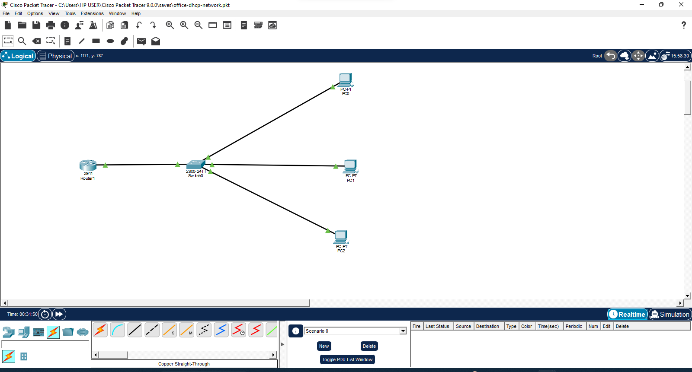
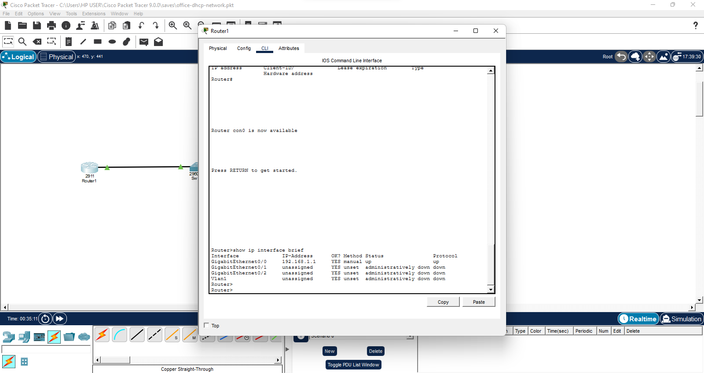
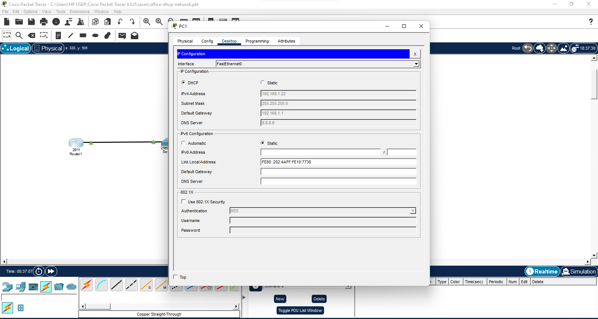
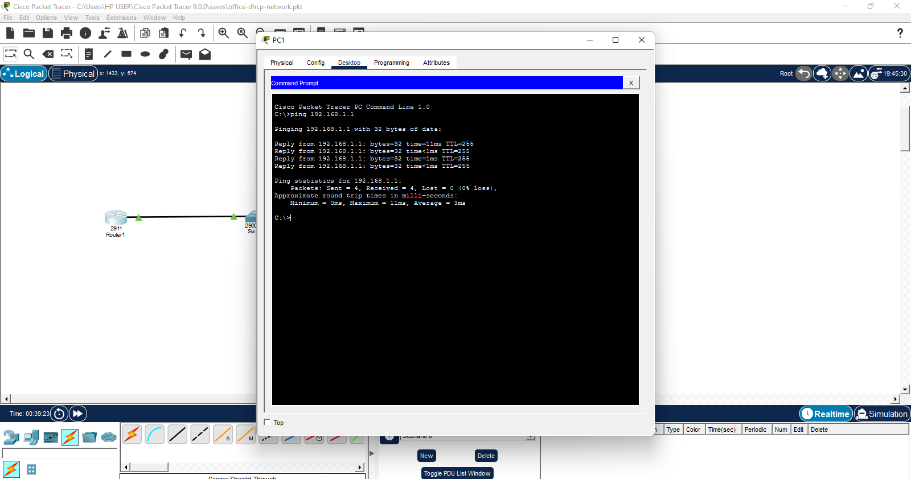
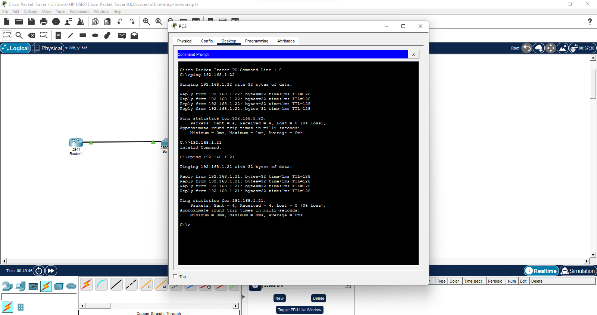

# 🖧 ICT Office Network Simulation (Packet Tracer)

This project is a practical ICT office network simulation built using Cisco Packet Tracer. It demonstrates real-world networking, infrastructure setup, and troubleshooting skills used in enterprise IT environments.

---

## 👨‍💻 Project Overview

This lab simulates a small office network environment with router-based DHCP, LAN connectivity, and device-to-device communication testing.

It reflects real ICT infrastructure setups commonly used in corporate environments such as enterprise offices and oil & gas companies.

---

## 🎯 Objectives

- Design a functional office LAN network
- Configure router interface (Gateway setup)
- Implement DHCP for automatic IP assignment
- Enable device-to-device communication
- Perform network troubleshooting and connectivity testing

---

## 🖧 Network Components

- 1 Router (Gateway + DHCP Server)
- 1 Switch (LAN distribution)
- 3 PCs (Client devices)

---

## ⚙️ Configuration Summary

### Router Setup
- IP Address: 192.168.1.1
- Subnet Mask: 255.255.255.0
- DHCP Enabled

### DHCP Pool
- Network: 192.168.1.0/24
- Default Gateway: 192.168.1.1
- DNS Server: 8.8.8.8

---

## 📡 Network Testing

- Automatic IP assignment via DHCP
- Successful ping between devices
- Successful communication with router gateway
- Verified LAN connectivity

---

## 📸 Evidence

### 🖧 Network Topology

### ⚙️ Router Status

### 📡 DHCP IP Assignment

### 💻 Ping Test (Router Connectivity)

### 🖥 Ping Test (Device Communication)

---

## 📁 Project File

You can open the full simulation using Cisco Packet Tracer:

- `office-dhcp-network.pkt`

---

## 🛠 Tools & Technologies

- Cisco Packet Tracer
- TCP/IP Networking Concepts
- DHCP Configuration
- LAN Design & Troubleshooting
- Command-line diagnostics

---

## 🧑‍💼 Real-World Relevance

This project simulates a real ICT office network environment similar to what is used in enterprise IT departments.

It demonstrates my ability to:
- Configure and manage LAN networks
- Implement DHCP services
- Troubleshoot connectivity issues
- Understand enterprise network infrastructure
- Support ICT operations in real organizations

---

## 🎯 Outcome

Successfully built and tested a functional office LAN network with automated IP assignment and full device connectivity.

This demonstrates practical ICT infrastructure and networking skills required in enterprise IT support and network administration roles.

---

⭐ Continuously improving networking and ICT infrastructure skills through hands-on labs.
